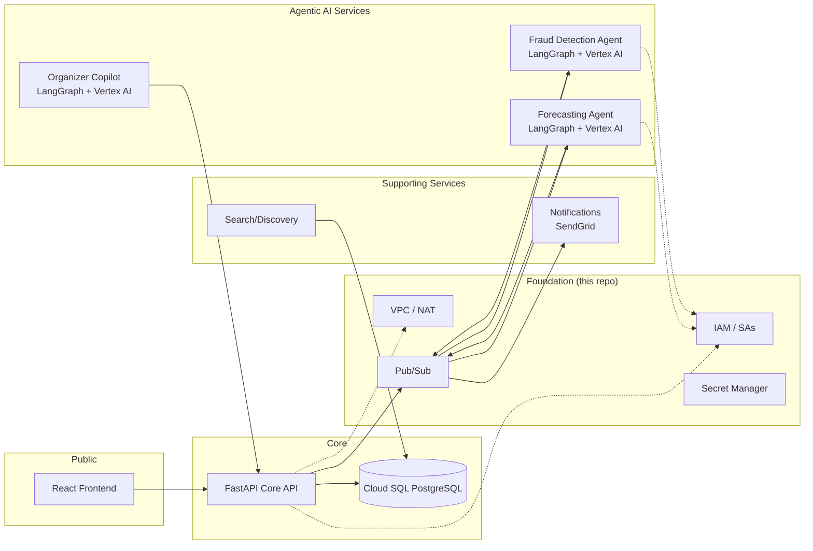

# Platform Context

This foundation repo does not contain application code. It provides the shared infrastructure that the **Event Ticketing Platform** and future weekly GCP projects consume.

## The Platform

An Eventbrite-style event ticket-selling platform with three agentic AI services and two supporting services:



## Why Foundation First

Every design decision in this repo accounts for the full platform:

1. **Per-service identity** — five services, five service accounts, least-privilege from day one
2. **Multi-topic messaging** — not one Pub/Sub topic, but separate streams for tickets, fraud, and forecasts
3. **Multi-region network** — subnets in ≥2 regions for future GKE node pools
4. **Environment separation** — dev/staging/prod baked into variable naming and resource labels

## Repo Relationship

```
gcp-terraform-foundation/     ← this repo (IaC modules)
event-ticketing-platform/       ← application code (FastAPI + React + agents)
  └── consumes foundation modules via Terraform module source
```

## Sprint Parallel Tracks

During the two-week foundation sprint, two tracks run in parallel:

| Track | Repo | Focus |
|---|---|---|
| Foundation | gcp-terraform-foundation | Terraform modules, concept docs |
| Platform | event-ticketing-platform | React UI, FastAPI API, data model, agents |

The platform track starts with frontend scaffolding and data models (Day 0), then progressively wires into foundation modules as they're built.
