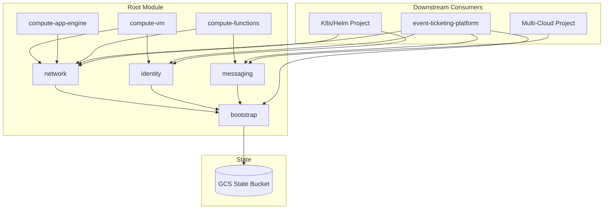

# Technical Architecture

## Current repo state (Day 0)

As of Day 0, this repository contains **documentation and a Terraform shell only** — no `main.tf`, no `modules/` directory, and no `terraform apply` yet. The layout below describes the **target** architecture; modules appear on their sprint days (see [sprint plan](../sprint-plan.md)).

| Path (Day 0) | Purpose |
|---|---|
| `versions.tf`, `variables.tf` | Provider requirements and input variables |
| `environments/dev/terraform.tfvars.example` | Dev project ID template |
| `scripts/__init__.py` | Python automation package (bootstrap/teardown on Day 1 / Day 12) |

## Overview

`gcp-terraform-foundation` is a composable Terraform root module with independent child modules (planned). Each child module owns one infrastructure concern and can be versioned/consumed independently by downstream service repos.



## Module Responsibilities

### bootstrap
Creates the GCS state bucket (versioned) and a backup bucket with lifecycle rules (Nearline at 30 days, Archive at 90). This is the **first** resource applied — everything else depends on remote state being available.

### network
VPC with public/private subnets across ≥2 regions, Cloud Router, Cloud NAT for private egress, deny-by-default firewall rules, and stubbed Cloud VPN/Interconnect for hybrid connectivity demos.

### identity
IAM custom roles and **per-service** service accounts. Designed from the start for five independent services:

| Service | Service Account Purpose |
|---|---|
| Core API | Cloud SQL, Pub/Sub publish, Secret Manager read |
| Forecasting agent | Vertex AI, Pub/Sub subscribe/publish, Cloud SQL read |
| Fraud detection agent | Pub/Sub subscribe, real-time scoring |
| Organizer copilot | Vertex AI generative calls |
| Notifications | Pub/Sub subscribe, SendGrid API |
| Search/discovery | Cloud SQL read, index updates |

### messaging
Pub/Sub topics and subscriptions designed for multiple event streams:

| Topic | Producers | Consumers |
|---|---|---|
| `ticket-events` | Core API (checkout) | Forecasting agent, fraud agent, notifications |
| `fraud-alerts` | Fraud detection agent | Core API, notifications |
| `forecast-recommendations` | Forecasting agent | Organizer dashboard, notifications |

### compute-vm / compute-app-engine / compute-functions
Three **standalone** compute modules (not combined). Each supports independent deployment patterns for different service load profiles.

## State Management

```
Bootstrap flow:
  1. terraform apply (local state) → creates GCS bucket
  2. Configure backend.tf → points to new bucket
  3. terraform init -migrate-state → state now remote
  4. All subsequent applies use remote state
```

State bucket naming: `{project_id}-tfstate-{environment}`

## Environment Strategy

| Environment | Purpose | force_destroy | Lifecycle |
|---|---|---|---|
| dev | Daily development, demos, recording | true | Aggressive cleanup |
| staging | Pre-prod validation | false | Standard lifecycle |
| prod | Production (future) | false | Standard lifecycle |

Each environment maps to a separate GCP project for clean billing and IAM boundaries.

## Secrets Architecture

| Secret Type | Storage | Access |
|---|---|---|
| Runtime (DB creds, Vertex AI keys) | GCP Secret Manager | Service account via IAM |
| CI/CD (deploy keys, SA keys) | GitHub encrypted secrets | GitHub Actions / Cloud Build |

## Cost Control

Two layers:

1. **Manual:** `scripts/teardown.py` — run after dev/recording sessions
2. **Automated:** Cloud Scheduler + Cloud Function auto-shutdown (Day 12)

## Future: Multi-Cloud & K8s

The module design anticipates:

- **K8s/Helm:** Each of the five services gets its own Helm chart on GKE. Network and identity modules already scope per-service.
- **Multi-cloud:** Notifications service moves to Azure Functions or AWS Lambda. Messaging module's Pub/Sub topics become the cross-cloud event bus boundary.
