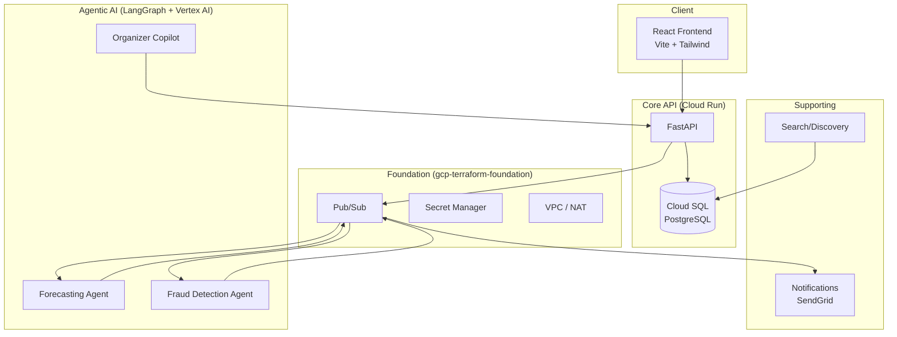

# Technical Architecture — Event Ticketing Platform

## Service Topology



## Request Flow: Ticket Purchase

1. User selects tickets on event page → cart state in React
2. Checkout form submitted → `POST /api/v1/orders`
3. API locks inventory (`SELECT FOR UPDATE` on ticket_tiers)
4. Fraud detection agent screens order via Pub/Sub → returns cleared/flagged/blocked
5. On cleared: decrement inventory, create order, publish `ticket-events` to Pub/Sub
6. Forecasting agent consumes event → may generate recommendation
7. Notifications service sends confirmation email

## Agent Response Shapes (Stubbed)

These interfaces in `frontend/src/types/` define the contract agents will fulfill:

### ForecastRecommendation
```typescript
{
  type: 'price_increase' | 'price_decrease' | 'inventory_adjustment';
  confidence: number;        // 0–1
  selloutRisk: 'low' | 'medium' | 'high' | 'critical';
  suggestedAction: string;
  status: 'pending' | 'applied' | 'dismissed';
}
```

### FraudCheckResult
```typescript
{
  status: 'pending' | 'cleared' | 'flagged' | 'blocked';
  confidence: number;
  reason: string | null;
}
```

## Environment Configuration

| Variable | Source | Used By |
|---|---|---|
| `DATABASE_URL` | Secret Manager | Core API |
| `VERTEX_AI_PROJECT` | Secret Manager | All agents |
| `PUBSUB_TOPIC_TICKET_EVENTS` | Terraform output | Core API, agents |
| `SENDGRID_API_KEY` | Secret Manager | Notifications |

Dev/staging/prod separation via environment-specific Secret Manager secrets and Terraform variable files.
